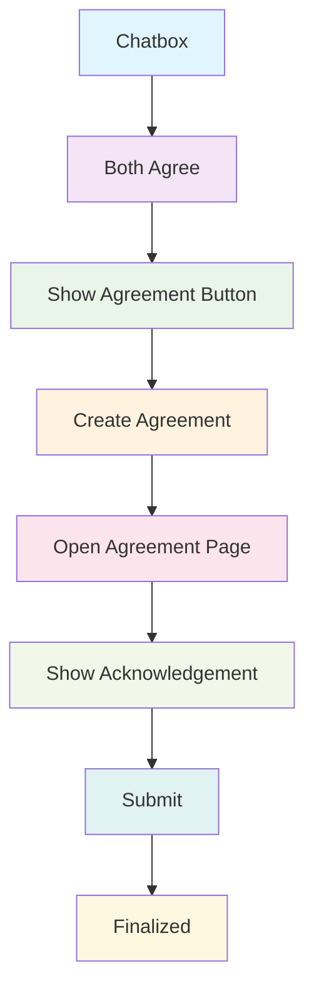

# Chatbox Agreement Feature Roadmap

## Overview
This document outlines the implementation roadmap for the chatbox agreement feature that enables startups and investors to create and finalize investment agreements directly through the platform.

## User Journey Flow

## Phase-by-Phase Implementation

### Phase 1: Chatbox Integration
- Add agreement proposal option within existing chat interface
- Implement real-time notification when agreement is proposed
- Add visual indicators for agreement status in chat threads

### Phase 2: Mutual Consent Mechanism
- Create "Agree" button for both parties
- Implement validation that both startup and investor click "Agree"
- Add timeout mechanism if consent isn't received within 48 hours

### Phase 3: Agreement Button Display
- Show "Create Agreement" button only after mutual consent
- Add tooltip explaining next steps
- Implement button state management (enabled/disabled)

### Phase 4: Agreement Creation Engine
- Develop agreement template system
- Create API endpoint for generating new agreements
- Implement data collection from chat history
- Add database storage for draft agreements

### Phase 5: Agreement Review Interface
- Design dedicated agreement page with clean layout
- Implement responsive design for all device sizes
- Add print and PDF export functionality
- Include version history tracking

### Phase 6: Acknowledgement Workflow
- Create checkbox system for term acknowledgment
- Implement section-by-section validation
- Add digital signature capability
- Include timestamp for each acknowledgement

### Phase 7: Submission Process
- Add final "Submit Agreement" button
- Implement dual-party submission requirement
- Create confirmation dialogs for irreversible actions
- Add progress indicator during submission

### Phase 8: Finalization & Archiving
- Update agreement status to "Finalized"
- Send confirmation emails to both parties
- Generate unique agreement ID
- Archive agreement in both user profiles
- Add to reporting dashboard

## Technical Requirements

### Core Components
1. **Agreement Model** - Database schema for storing agreement details
2. **Agreement API** - RESTful endpoints for agreement operations
3. **Real-time Notifications** - WebSocket integration for instant updates
4. **Document Generation** - PDF creation for formal agreements
5. **Digital Signature** - Component for legally binding electronic signatures
6. **Email Service** - Automated notifications for agreement milestones

### Database Schema
- Agreement ID (UUID)
- Party A (Startup) details
- Party B (Investor) details
- Agreement terms and conditions
- Status tracking (draft, pending, acknowledged, finalized)
- Timestamps for all major actions
- Digital signatures from both parties

### Security Considerations
- End-to-end encryption for agreement data
- Secure storage of digital signatures
- GDPR compliance for personal data
- Audit trail for all agreement actions

## Development Timeline

### Week 1-2: Foundation
- Set up agreement database schema
- Create basic API endpoints
- Implement chatbox integration

### Week 3-4: Agreement Creation
- Build agreement template engine
- Develop agreement creation workflow
- Implement mutual consent mechanism

### Week 5-6: Review Interface
- Design and implement agreement review page
- Add PDF generation capability
- Create digital signature component

### Week 7-8: Finalization & Testing
- Implement submission workflow
- Add real-time notifications
- Conduct thorough testing
- Prepare for production deployment

## Success Metrics

- Agreement completion rate (target: 70% of agreed chats)
- Average time from chat to finalized agreement (target: < 5 days)
- User satisfaction score (target: > 4.5/5)
- Error rate in agreement process (target: < 1%)